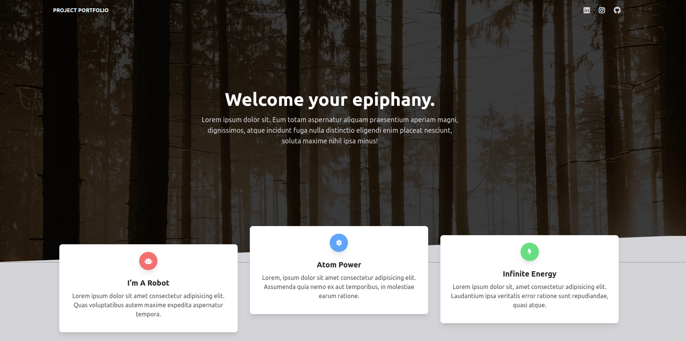
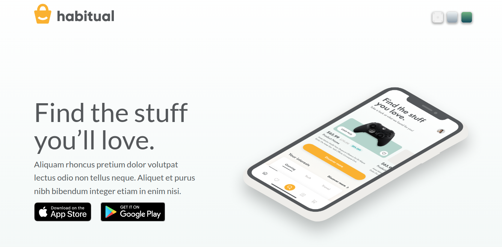

## basicJS && advancedJS ++

<table>
<tr>
    <th align="center" style="width: 50%;">
        
        
 
            <small>
                Project Name
            </small>
        

    </th>
    <th align="center" style="width: 50%;">
        
        
 
            <small>
                Image
            </small>
        

    </th>
</tr>
<tr>
    <td align="center"><strong>Tailwind: Animated Template</strong></td>
    <td align="center">
        
    </td>
</tr>
<tr>
  <th align="center" style="width: 50%;">
        
        
 
            <small>
                BasicJS
            </small>
        

    </th>
    <th align="center" style="width: 50%;">
        
        

            <small>
                AdvancedJS
            </small>
        

    </th>
</tr>
<tr>
    <td align="center">
        
        
        
    </td>
    <td align="center">
        
          
        
    </td>
</tr>
<tr>
    <td align="center" colspan="2">
         
        

            <small>
            </small>
        

    </th>
</tr>
<tr>
    <td align="center"><strong>Figma: Splash Page</strong></td>
    <td align="center">
        
    </td>
</tr>
<tr>
    <td align="center">
        
        
    </td>
    <td align="center">
        
        
    </td>
</tr>
</table>
